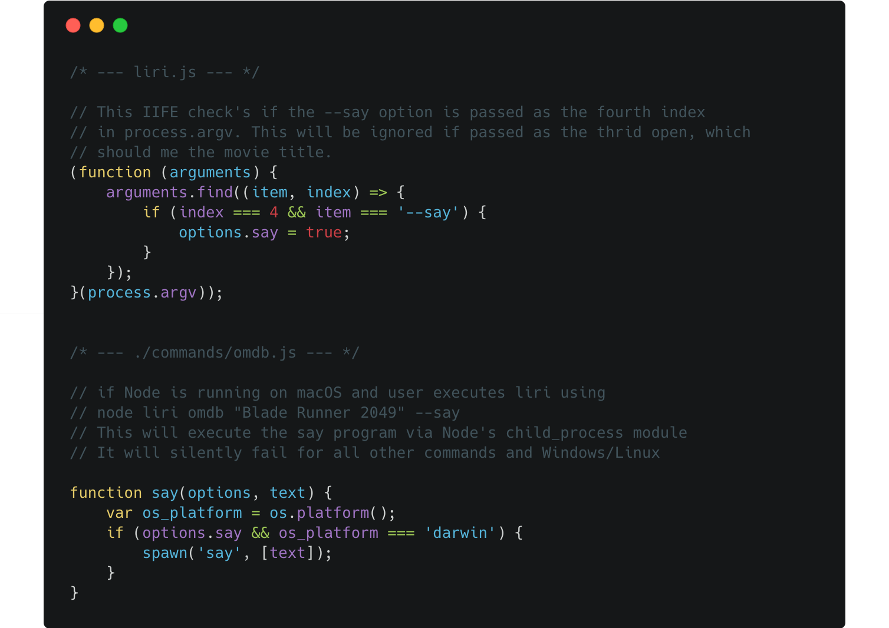

# LIRI (Language Interpretation and Recognition Interface) 

LIRI is a command line Node application that takes in parameters (via command line arguments or file input) to display tweets, songs from Spotify, and movie information from OMDB.

---------------------------

## Table of Contents

- [Liri Commands](#liri-commands)
- [Make LIRI speak](#make-liri-speak)
- [Install and run via NPM](#install-and-run-via-npm)
- [Resources](#resources)

---------------------------

### LIRI Commands

**Command**|**Value**|**Options**|**Example**|**Description**
:-----:|:-----:|:-----:|:-----:|:-----:
movie|"movie title"|--say|node liri "Blade Runner 2049" --say|Display movie information from OMDB. If host environment is macOS/Darwin, the --say flag will convert the plot text to audible speech.
spotify|"song title"|-|node liri "Thriller"|Display song information from Spotify. The default song is "The Sign" if no value is entered via the command line.
tweets|twitter handle|-|node liri "jeffreylowy"|Display 20 tweets from Twitter. The default account is @barackobama if no value is entered via the command line.
do-what-it-says|-|-|node liri do-what-it-says|Run whatever command and value are saved to the random.txt stored in the commands directory

_You can also run via npm scripts. See [Install and run via NPM](#install-and-run-via-npm)_

### Make LIRI speak

If Node is running on macOS/Darwin, you can make LIRI read movie plot information by passing the `--say` flag after the movie's title. This only works when the full command is entered.

Example: `node liri movie "Blade Runner 2049" --say`

### Install and run via NPM

This project was uploaded to NPM under the package name `liri-cli`.

Install: `npm i liri-cli`

If installed via NPM you can run using NPM scripts

Example: `npm run [movie, spotify, tweets, do] <value>`

__*If installed via NPM you will need to create a .env file in the root directory to store your keys/tokens*__

OMDB_API_KEY=XXXXX  
SPOTIFY_CLIENT_ID=XXXXX  
SPOTIFY_CLIENT_SECRET=XXXXX  
TWITTER_CONSUMER_KEY=XXXXX  
TWITTER_CONSUMER_SECRET=XXXXX  
TWITTER_ACCESS_TOKEN_KEY=XXXXX  
TWITTER_ACCESS_TOKEN_SECRET=XXXXX  

For more information, visit the NPM page for [dotenv](https://www.npmjs.com/package/dotenv).

### Resources 

[Node docs: child_process.spawn](https://nodejs.org/api/child_process.html#child_process_child_process_spawn_command_args_options)

[MDN: Number.prototype.toLocaleString()](https://developer.mozilla.org/en-US/docs/Web/JavaScript/Reference/Global_Objects/Number/toLocaleString)

[MDN: async function](https://developer.mozilla.org/en-US/docs/Web/JavaScript/Reference/Statements/async_function)

[Carbon: Source code images](https://carbon.now.sh/)

[David Walsh: Git Undo](https://davidwalsh.name/git-undo)

[codeburst.io: Array.find & Array.findIndex](https://codeburst.io/learn-javascript-es6-array-find-array-findindex-7fe4f63c6974)
