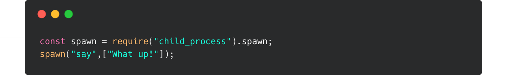

# LIRI (Language Interpretation and Recognition Interface) 

LIRI is a command line Node application that takes in parameters (via command line arguments or file input) to display tweets, songs from Spotify, and movie information from OMDB.

---------------------------

---------------------------

### Make LIRI speak using Node's child_process.spawn 

### Dependencies

### Resources 

[Node docs: child_process.spawn](https://nodejs.org/api/child_process.html#child_process_child_process_spawn_command_args_options)

[MDN: Number.prototype.toLocaleString()](https://developer.mozilla.org/en-US/docs/Web/JavaScript/Reference/Global_Objects/Number/toLocaleString)

[MDN: async function](https://developer.mozilla.org/en-US/docs/Web/JavaScript/Reference/Statements/async_function)

[Carbon: Source code images](https://carbon.now.sh/)
